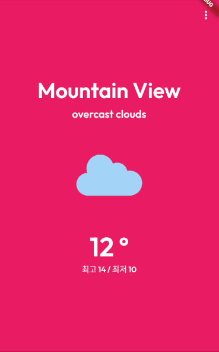

# appBar 투명하게 하는 방법

상단 우측에 드롭다운 메뉴를 생성하려고 했으나 DropdownButton 클래스는 내가 원하는 디자인이 아니었다. (세로방향의) ... 버튼만 노출되게 하고 싶었으나 DropdownButton 클래스는 값을 선택하면 선택 값이 노출된다. 직접 구현을 하려면 Overlay 클래스를 활용하면 가능해보였으나 시간 소요가 많이 들 것 같아서 추후에 따로 학습하는게 더 좋다고 판단했다. 빠르게 드롭다운 메뉴를 생성하기 위해 appBar 클래스의 actions에 PopupMenuButton 클래스를 정의하여 만들기로 했다.

한가지 문제점은 appBar는 사용하지 않고 싶어서 투명하게 처리하고 싶었다. appBar의 backgroundColor만 Colors.transparent로 처리하려고 했으나 그렇게 되지 않았고 body가 appBar 영역만큼 밀려서 아래로 내려가게 됐다.

appBar가 영역을 따로 차지하지 않으면서 완전히 투명하게 되려면 3가지를 설정해주면 된다.

<br>

### backgroundColor

```dart
Scaffold(
    appBar: AppBar(
		backgroundColor: Colors.transparent
	)
)
```

<br>


<br>

appBar의 배경색만 투명으로 하게되면 위 이미지처럼 배경보다 진하게 보이고 appBar가 영역을 차지해서 body영역이 아래로 내려간다.

<br>

### extendBodyBehindAppBar

```dart
Scaffold(
    extendBodyBehindAppBar: true,
    appBar: AppBar(
		backgroundColor: Colors.transparent
	)
)

```

<br>

body가 appBar의 영역까지 차지하도록 설정해주면 body가 appBar의 영역까지 자신의 영역으로 인지하고 차지하게 된다.

<br>


<br>

### elevation

```dart
Scaffold(
    extendBodyBehindAppBar: true,
    appBar: AppBar(
    	elevation: 0,
		backgroundColor: Colors.transparent,
	)
)
```

<br>

appBar의 elevation을 0으로 설정하여 body 보다 아래에 놓이게 한다. css의 z-index와 비슷한 역할을 한다.

<br>



<br>

참조

https://api.flutter.dev/flutter/material/AppBar-class.html

https://api.flutter.dev/flutter/material/AppBar/actions.html

https://api.flutter.dev/flutter/material/PopupMenuButton-class.html

https://sarunw.com/posts/how-to-make-appbar-transparent-in-flutter/