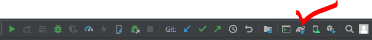

# Flutter 안드로이드 스튜디오 Sync Project with Gradle Files 버튼 찾기

안드로이드의 build.gradle을 수정하면 Sync Project with Gradle Files 를 진행해야 한다고 하는데, 안드로이드 스튜디오 버전이 올라가면서 해당 기능을 수행할 수 있는 버튼을 찾기가 쉽지 않았다.

안드로이드 스튜디오로 플러터 프로젝트 안의 안드로이드 프로젝트만 따로 열면 우측 상단의 AVD Manager 버튼 왼쪽에 Sync Project with Gradle Files 버튼을 확인할 수 있다.

 

참고

https://stackoverflow.com/questions/60259799/where-is-the-sync-project-with-gradle-files-option-in-android-studio-3-5-3