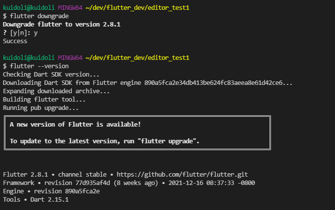

# 플러터 버전을 낮추는 방법

```bash
flutter downgrade
flutter --version
```

<br>

터미널에 flutter를 입력하면 관련된 명령어들을 확인할 수 있다.

flutter downgrade는 현재 들어와있는 flutter channel의 가장 최신에 사용했던 버전으로 바꾼다.

<br>



<br>


<br>

### 특정 버전으로 플러터 버전 낮추는 방법 (실제로 테스트 못해봄)

이전에 플러터 버전을 낮춰보려다 실패한 적이 있어서 우연히 [해당](https://velog.io/@itstime/Flutter-version-downgrade) 글을 발견하여 훗날 필요할때 보기 위해 링크만 남겨두려고 작성해둔다.

<br>

<참고>

https://velog.io/@itstime/Flutter-version-downgrade

